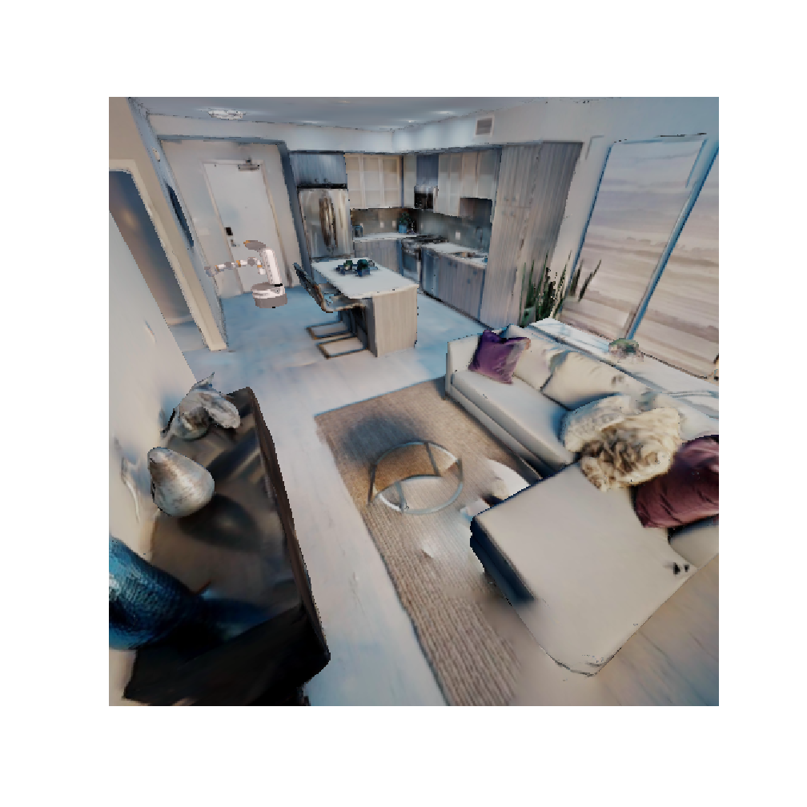

# Robot Navigation Using Neural Riemannian Motion Policy based on the third-perspective cameras
This is the repo for project in CSE 571. More details on iGibson simulator coming soon.


## Dependencies
### Ubuntu 16.04
### Python 3.6
### iGibson

## Train

``` 
python train.py 
``` 